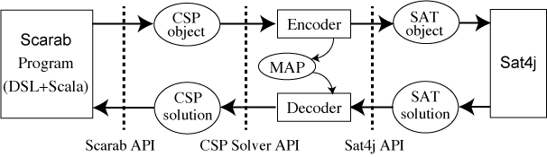

<table class="menu" border="0" cellspacing="0" cellpadding="20" width="900px">
<tr>
<td class="menu" bgcolor="#3B5998"><a href="index.html">Home</a></td>
<td class="menu" bgcolor="#3B5998"><a href="examples.html">Examples</a></td>
<td class="menu" bgcolor="#3B5998"><a href="doc.html">Documents</a></td>
<td class="menu" bgcolor="#3B5998"><a href="advanced.html">Advanced Usage</a></td>
<td class="menu" bgcolor="#3B5998"><a href="tutorial.html">Tutorial</a></td>
<td class="menu" bgcolor="#3B5998"><a href="apps.html">Apps</a></td>
</tr>
</table>

# Introduction

This web page details **Scarab** system which is a prototyping tool for
developing SAT-based systems. It provides a rich constraint modeling
language on Scala and enables a programmer to rapidly specify problems
and to experiment with different modelings.

-   **Expressiveness:**

    -   Scarab DSL can concisely write constraint modelings with the help of rich functionalities of Scala.
    -   The expressiveness of Scarab will be also shown by some prototyping examples for an optimization version of Square Packing.

-   **Efficiency:**

    -   Scarab can be efficient in the sense that it uses an optimized version of the order encoding which an award-winning CSP solver [Sugar](http://bach.istc.kobe-u.ac.jp/sugar/) adopted.
    -   Scarab also can utilize current state-of-the-art SAT techniques.

-   **Customizability:**

    -   Scarab allows a programmer to customize his/her own constraints and to customize the search strategies.
    -   Scarab itself can be also customizable since it is **500** lines
        (800 lines in version 1.0.4) long without any comments.
    -   In particular, our core part of order encoding module is only **25** lines long.

-   **Portability:**

    -   The current version of Scarab adopts [Sat4j](http://www.sat4j.org) as the back-end SAT solver.
    -   The combination of Scarab and Sat4j makes it possible to develop portable SAT-based systems that run on any platform supporting Java.

# Presentation Slide

-   [ScalaMatsuri2014](talk.pdf)

-   (JP) [ScalaMatsuri2014-jp](talk-jp.pdf)

# Scarab Paper (Presented in PoS-13)

-   You can also see details of Scarab from a [paper](./pos2013scarab.pdf) presented in PoS-13.

# Process Flow of Scarab

-   **User Program (in Scala and Scarab DSL):**

    -   The process starts with a user program, which will first define Scarab objects
    -   Those definitions are typically done by the followng Scala program:
    
        val csp = new CSP()
        val satSolver = new Sat4j()
        val encoder = new OrderEncoder(csp,satSolver)
        val solver = new Solver(csp,satSolver,encoder)
    
    -   Each line creates a new CSP object (**csp**), SAT solver object (**satSolver**), Encoder object (**encoder**), and Solver object (**solver**), which are shown in the above figure.
    -   Initially, of course, the CSP object has nothing and the next task is to add contents of it
    -   To do that, Scarab DSL provides the following methods for constructing a CSP:
        -   **int**, **bool** for adding integer variables and Boolean variables to the CSP object.
        -   **add** for adding constraints to the CSP object.
        -   The syntax of constraints in Scarab is given below in this page.

-   **CSP Object:**

    -   A CSP object consists of the followings, which will be defined in the user program:
        1.  integer variables
        2.  Boolean variables
        3.  domain function of integer variables
        4.  constraints
    -   All objects above are defined as var objects. Totally, CSP is a mutable object.

-   **Encoder (Decoder):**

    -   It encodes each element of a given CSP according to SAT encoding method (currently, order encoding)
    -   Simultaneously, encoded SAT clauses are passed to Sat4j solver on memory
    -   It also decodes assignments of SAT variables to assiginments of CSP variables by using a mapping object.

-   **Sat4j:**

    -   Scarab provides an interface to Sat4j and can directly call it.
    -   Thus, we can use Sat4j without generating CNF files, invoking outer processes, and parsing output logs.
    -   After solving problems, we can obtain assignments of SAT variables

# Syntax of Scarab DSL (for Constraints)

-   Let **V**, **T**, **C** and **B** be the Scarab objects of **Var**, **Term**, **Constraint**, and **Bool**.

-   Let Int, String, and Any be Scala objects.

-   The syntax of Scarab DSL is defined as follows:

        T  ::= V | -T | T + Int | T + T | T - Int | T - T | T * Int | Sum(V, ...) | Sum(Seq(V, ...))  
        V  ::= Var(String, String, ...) | V(Any, ...)
        C  ::= B | T op T | !C | C && C | C || C | alldiff(Seq(T, ...)) |  
              And(C, ...) | And(Seq(C, ...)) | Or(C, ...) | Or(Seq(C, ...))
        op ::= <= | < | => | > | === | !==
        B  ::= Bool(String, String, ...) | B(Any, ...)

-   Examples of Constraint

    -   A constraint \(x_{1} + 3 \le 4\) is written as follows
    
            'x(1) + 3 <= 4

# API Documents and Class Diagrams of Scarab

-   [Scarab API](./docs/api/index.html) (see also Sat4j version 2.3.3 API [Sat4j API](./sat4j/doc/index.html))

-   CSP package

    

    
    
    
    

-   Solver package

    

    
    
    
    
